<!--
  ╔══════════════════════════════════════════════════════════════════╗
  ║  Masaaki Yamaguchi — README.md                                   ║
  ║  SVGアニメーション埋め込み技:                                    ║
  ║  ① assets/header.svg    ← アニメーション付きSVGをimgタグで表示  ║
  ║  ② assets/stats.svg     ← 統計バー                              ║
  ║  ③ assets/equations.svg ← 方程式ショーケース                    ║
  ║  ④ assets/timeline.svg  ← 研究タイムライン                      ║
  ║  ⑤ index.html           ← GitHub Pagesで完全アニメーションサイト ║
  ╚══════════════════════════════════════════════════════════════════╝
-->

<!-- ═══ HERO HEADER SVGアニメーション ═══ -->
<div align="center">

</div>

---

<div align="center">

### 🌐 [フルサイト（CSS・JSアニメーション完全版）を見る →](https://masaaki-avnturle.github.io/tuplenetwork)

[](https://masaaki-avnturle.github.io/tuplenetwork)
[](https://github.com/masaaki-avnturle)
[](https://github.com/masaaki-avnturle)

</div>

---

<!-- ═══ STATS BAR SVGアニメーション ═══ -->


---

## 🔬 Yamaguchi Framework — 理論体系

大域的微分多様体を核として、数学・物理学・情報科学・人工知能を単一の方程式系で統一する独自理論。
ジョーンズ多項式・サーストン分類・ペレルマン多様体を出発点に、LLMアーキテクチャとの同型性を導く。

| 領域 | 核心概念 | 核心方程式 |
|:-----|:--------|:----------|
| **∇ 大域的微分多様体** | Shannon entropy kernel · Γ(x,y) | `d/df F(x,y) = ∬1/(x·logx)² dx_m + … = Γ(x,y)` |
| **β ガンマ・ベータ函数系** | 積分変換の統一 · 宇宙のDNA | `β(p,q) = Γ(p)Γ(q)/Γ(p+q) = ζ(s)·log x` |
| **π 非可換作用素 π(χ,x)** | Heisenberg交換子と同型 | `π(χ,x) = [iπ(χ,x), f(x)]` |
| **⊕ 量子作用素** | HΨ = Γ函数積分 | `⊕(iℏ∇)^⊕L = e^{-x·log x}` |
| **Ω TupleSpace · Akashic** | Omega::DATABASE不変空間 | `Ω::DATABASE ⊃ Z ⊃ C ⊕ ∇R⁺` |
| **𝒥 Jones多様体** | 結び目不変量 · LLM位相構造 | `‖ds²‖ = ‖x^½·log x‖⁴ = ζ(s)` |

---

<!-- ═══ EQUATION SHOWCASE SVGアニメーション ═══ -->
## 📐 方程式ショーケース



<details>
<summary><b>▶ 全方程式アーカイブを展開する（54+ equations）</b></summary>

### Beta / Gamma 関数
```
β(p,q) = ∫₀¹ x^(1-t)(1-x)^t dx = Γ(p)Γ(q)/Γ(p+q)
Γ(s)   = ∫₀^∞ e^(-x)·x^(s-1) dx
Γ'(s)  = ∫₀^∞ e^(-x)·x^(s-1)·log x dx
d/dγ Γ = Γ(γ)'  →  e^(-x·log x)
β(p,q) = β(p,q)/log x = β(p,q)/ζ(s)
```

### Zeta / Shannon 関数
```
ζ(s)  = β(p,q)/log x  =  x·log x
‖ds²‖ = ‖x^(½)·log x‖⁴  =  x^(-½)
E(σ)  = K(σ) ⊗ H(σ),   ζ(s) = β(p,q)/log x
∫ζ(s)dx_m = β(p,q)/log x = ∫ζ(s)·e^(-f)dV
```

### π演算子 / Dalanversian
```
π(χ,x) = [iπ(χ,x), f(x)]          ← non-commutative
□ = 2(sin(ix·log x) + cos(ix·log x))
□ = cos(ix·log x) − i·sin(ix·log x)
∫e^(-□)d□ = πe,   πe ≅ eπ
```

### 大域的微分多様体
```
d/df F(x,y) = ∬1/(x·log x)² dx_m + ∬1/(y·log y)^½ dy_m = Γ(x,y)
HΨ = ⊕(iℏ∇)^⊕L = e^(x·log x) = x(x)'
log(x·log x) ≥ 2(y·log y)^(1/2)
‖ds²‖ = ∫[D²ψ ⊗ hν]dτ  ← D-brane
```

### Jones 多項式 / 結び目理論
```
E(σ) = K(σ) ⊗ H(σ) = β^(-1)(x)·x·β(x)
bpc(1χ·∂)∭∭∭ = ht    ← topological crossing
‖ds²‖ = ‖x^½·log x‖⁴ = ζ(s)
ζ = (at − tⁿ + a) = eᶠ
```

### 一般相対性理論 / AdS5
```
∫κT^μν dvol = ∫(R + ½·g_ij·Λ) dx_m
‖ds²‖ = e^(-2πT‖ψ‖)[η + h̄(x)] dx^μdx^ν + T²d²ψ
□ = −16πG/c⁴ · T^μν  |  □ = 8πG/c⁴ · T^μν/log x
x^n + y^n − nxyz = 0   ← Fermat × AdS5
```

### 量子力学 / Heisenberg
```
|ψ(t)⟩ = e^(-iĤt)|Ψ⟩_H,   dÂ/dt = 1/iℏ[A,Ĥ]
⊕(iℏ∇)^⊕L = ĤΨ/iℏ = e^(HΨ·log HΨ)
d/dt ψ(t) = ℏ = ½·ie^(iĤ)
```

### エントロピー / Euler定数
```
C  = ∫(1/x^s dx − log x),   C = 0.5772156…
d/df F + ∫C dx_m = 2(cos(ix·log x) − i·sin(ix·log x))
∫∫1/(x·log x)² dx_m = ½·i
x^{½+iy} = e^{x·log x}  ← ζ(s) connection
```

### Magic演算子 / Dalia函数
```
∇∆ = ∮D M(□)d□,   π(χ,x) = ∮M[iπ(χ,x),f(x)]
T^{≪(p,q)}, ▷◁ = β(p,q)/log x = D²ψ ⊗ hν
log(x·log x) ≥ 2(y·log y)^½
```

</details>

---

## 📄 Research Papers — 論文一覧

| # | Paper | 日本語タイトル | Keywords |
|:-:|:------|:-------------|:---------|
| 01 | **Beta Function Reveal with Global Differential Manifold** | ベータ函数と大域的微分多様体の解明 | `β函数` `Γ函数` `Jones多様体` `量子力学` |
| 02 | **DNA of Universe and Human Being with Zeta Function** | 宇宙と人体のDNA — ゼータ函数 | `ζ函数` `Shannon公式` `一般相対性理論` |
| 03 | **Euler Product from Heisenberg Non-commutative** | ハイゼンベルク非可換方程式からのオイラー積 | `非可換代数` `Dalanversian` `反重力` |
| 04 | **Artificial Intelligence and TupleSpace Ultranetwork** | 人工知能とウルトラネットワークのTupleSpace | `TupleSpace` `作用素環` `Bada言語` |
| 05 | **Library of Akashic Record** | アカシックレコードの図書館 | `Calabi–Yau` `D-ブレーン` `コホモロジー` |
| 06 | **M Theory Equal with AdS5 Manifold** | M理論とAdS5多様体 | `AdS5` `Calabi–Yau` `Hodge予想` |
| 07 | **Secureproduct from Differential Manifold of Quantum Level** | 量子レベル微分多様体からのSecureproduct | `Secureproduct` `虚数極` `Weil予想` |
| 08 | **Magic Operate with Dalia Function System** | ダリア函数システムによるMagic演算子 | `Magic演算子` `Timebow方程式` `D-ブレーン` |
| 09 | **M Dimension from Catastrophe Theory** | カタストロフィ理論によるM次元多様体 | `カタストロフィ` `M次元` `結び目理論` |
| 10 | **微分幾何の量子化による大域的切断多様体** | Differential Geometry Quantization | `コホモロジー` `量子化` `Hörmander作用素` |
| 11 | **Amino Medicine Architect** | アミノ医薬設計 | `有機化学` `アミノ酸` `医薬設計` |
| 12 | **Recycle — PVC Decomposition via Sodium Phenoxide** | 塩化ビニルのナトリウムフェノキシド分解 | `リサイクル化学` `PVC分解` `特許` |
| 13 | **Fullnitorazpam Recreated from Amail** | フルニトラゼパムの再構成 | `医薬化学` `磁性体生成` `Gauss曲面` |
| 14 | **Cafe / Journal / Resume** | カフェ論文集 · ジャーナル · 履歴書 | `研究記録` `履歴書` `ジャーナル` |

---

## 💻 Software Projects — 実装

<table>
<tr>
<td width="50%">

### 🔤 Bada Language
`C` · OOP × 多様体演算子

山口フレームワーク作用素環プログラミングをC言語で実装した独自言語。
カスタム演算子 `<-` `-<` `>-` と20種のオブジェクト型。
TupleSpace/Omega::DATABASEをネイティブ型として実装。**4000+ LOC**

</td>
<td width="50%">

### 🖥️ BadaOS
`C` · Ubuntu互換 OS Simulator

Bada上に構築したOSシミュレータ。仮想FS・プロセススケジューラ・
aptスタイルパッケージマネージャ・systemd-lite・
インタラクティブシェル完備。**4000+ LOC**

</td>
</tr>
<tr>
<td>

### 🧠 omega_llm
`C` · LLM Engine

π-softmax・ℏ_eff注意スケーリング・gamma-deprivation activation・
TupleSpaceメモリ実装。`omega_core.h` / `omega_math.c` /
`omega_tuplespace.c` / `omega_attention.c` / `omega_model.c`

</td>
<td>

### 🔵 Jones-NN LLM Apps
`HTML/JS` · Claude API

GoFデザインパターンをJones多項式結び目ノードとして実装したLLMアプリ群。
Shannon entropy四層構造スコアリング・Claude API統合。

</td>
</tr>
<tr>
<td>

### 🎙️ Silent Talk
`HTML/JS` · Subvocalization

声帯発話・準発話・サイレント/体内リズムの3モード認識。
Jones結び目可視化・Shannon/β(p,q)メトリクス・Euler多様体摂動統合。

</td>
<td>

### 🏁 Go & Shogi AI
`HTML/JS` · Quantum Manifold AI

x·log x, π(χ,x), □, β(p,q)で陣地スコアリング・手選択温度を制御する
量子多様体着想AIエンジン搭載の囲碁・将棋。

</td>
</tr>
<tr>
<td>

### ⚗️ TeX 数式清書エディタ
`HTML/JS` · MathJax

全PDFから抽出した150種以上の固有方程式パレット搭載。
MathJaxリアルタイムプレビュー・LaTeX論文出力対応。

</td>
<td>

### 🔬 有機化学 構造式エディタ
`HTML/JS` · chemfig / SMILES

手書き感覚で有機分子を描画するキャンバス型エディタ。
chemfig/mhchem TeX出力・SMILES記法生成・30種以上官能基ライブラリ。

</td>
</tr>
<tr>
<td colspan="2">

### 🌐 Bada Engine (React)
`React` · Unknown Prior Knowledge Engine

`P(θ|D) ∝ Γ(α+H(D)) · β(H_theory, H_proof) / ζ(H_conclusion+1)` をReactで実装。
TupleSpace・π-softmax・多様体可視化を統合したChatGPT再発明アーキテクチャ。

</td>
</tr>
</table>

---

<!-- ═══ TIMELINE SVGアニメーション ═══ -->
## 📅 Research Timeline



---

## 📬 Contact

<div align="center">

[](https://github.com/MasaakiYamaguchi)
[](https://MasaakiYamaguchi.github.io/)

山口フレームワークは現在も進化中です。
数学・物理学・コンピュータサイエンスの研究者、またはフレームワークの実装に興味のある開発者からのご連絡をお待ちしています。

```
d/df F(x,y) = ∬1/(x·log x)² dx_m + ∬1/(y·log y)^½ dy_m = Γ(x,y)
         ζ(s) = β(p,q)/log x = x·log x
               ⊕(iℏ∇)^⊕L = e^{-x·log x}
```

*© 2025 Masaaki Yamaguchi · 山口 雅彰 · Global Differential Manifold Research*

</div>

<!--
════════════════════════════════════════════════════════════════
  【GitHubへのアップロード手順】

  Step 1: リポジトリ構成
  ─────────────────────────────────────────────────────────
  MasaakiYamaguchi/          ← username と同名の特別リポジトリを作成
  ├── README.md              ← このファイル（プロフィールTOPに表示）
  ├── index.html             ← GitHub Pages フルアニメーションサイト
  └── assets/
      ├── header.svg         ← ヒーローアニメーション
      ├── stats.svg          ← 統計バー
      ├── equations.svg      ← 方程式ショーケース
      └── timeline.svg       ← 研究タイムライン

  Step 2: GitHub Pages を有効化
  ─────────────────────────────────────────────────────────
  Settings → Pages → Source: Deploy from a branch
  → Branch: main / root → Save
  → https://MasaakiYamaguchi.github.io/ でindex.htmlが表示される

  Step 3: プロフィールREADMEとして表示させる
  ─────────────────────────────────────────────────────────
  リポジトリ名を "MasaakiYamaguchi" にすると
  github.com/MasaakiYamaguchi のプロフィールページに
  README.mdが自動的に表示される（特別機能）

  Step 4: SVGアニメーションの仕組み（技術解説）
  ─────────────────────────────────────────────────────────
  GitHubはMarkdownの  タグ内の
  CSS @keyframes アニメーションをサンドボックスで実行する。
  - ✅ CSS animation / @keyframes → 動作する
  - ✅ SVG SMIL アニメーション  → 動作する
  - ❌ JavaScript               → セキュリティ上 動作しない
  - ❌ iframe / object          → 禁止されている
  → SVGファイルにCSSアニメーションを埋め込み、
    imgタグで参照するのが「GitHub README アニメーション埋め込みの技」

  Step 5: index.html との連携
  ─────────────────────────────────────────────────────────
  READMEの冒頭リンクから GitHub Pages の index.html へ誘導。
  index.html には Canvas アニメーション・JS・フルCSS が使えるため
  完全なインタラクティブサイトとして機能する。
════════════════════════════════════════════════════════════════
-->
